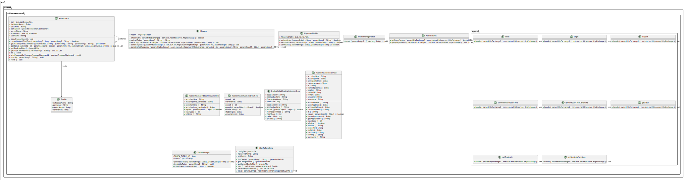

# Onlinemanager REST

## Local test
```bash
( curl -svX POST http://localhost:8080/hello | jq . ) 2>&1 | less
( curl -svX POST http://localhost:8080/getdata -d "usernamefilter=@r525-1" -H "Authorization: Bearer $( curl -sX POST http://localhost:8080/login -d "username=YOU_USERNAME&password=YOU_PASSWORD" )" | jq . ) 2>&1 | less
( curl -svX POST http://localhost:8080/getduplicate -H "Authorization: Bearer $( curl -sX POST http://localhost:8080/login -d "username=YOU_USERNAME&password=YOU_PASSWORD" )" | jq . ) 2>&1 | less
( curl -svX POST http://localhost:8080/getduplicatesessions -d "username=dhcp_xe-0/0/3:1630@r418-1" -H "Authorization: Bearer $( curl -sX POST http://localhost:8080/login -d "username=YOU_USERNAME&password=YOU_PASSWORD" )" | jq . ) 2>&1 | less
( curl -svX POST http://localhost:8080/getacctstoptimecandidate -d "starttime=2026-03-05+10:49:10&username=dhcp_xe-0/0/3:1630@r418-1&ip=212.90.172.135" -H "Authorization: Bearer $( curl -sX POST http://localhost:8080/login -d "username=YOU_USERNAME&password=YOU_PASSWORD" )" | jq . ) 2>&1 | less
( curl -svX POST http://localhost:8080/correctionacctstoptime -d "id=18113341&stoptime=2026-03-05+18:35:42" -H "Authorization: Bearer $( curl -sX POST http://localhost:8080/login -d "username=YOU_USERNAME&password=YOU_PASSWORD" )"
```

## Docker

### Build
```bash
docker build -t onlinemanager-rest .
```

### Run

#### Dockerfile
```bash
docker run -d \
  --name rest-test \
  -p 7580:8080 \
  -v "$(pwd)/onlinemanager.config.xml:/app/onlinemanager.config.xml" \
  -v "$(pwd)/htpasswd.txt:/app/htpasswd.txt" \
  onlinemanager-rest
```

#### Compose

Docker Compose Yaml:
```bash
services:
  rest-api:
    image: onlinemanager-rest:latest
    container_name: onlinemanager-rest
    restart: unless-stopped
    volumes:
      - ../onlinemanager/onlinemanager.config.xml:/app/onlinemanager.config.xml:ro
      - ../onlinemanager/htpasswd.txt:/app/htpasswd.txt:ro
    networks:
      - app-network

  certbot-rest-api:
    image: certbot/certbot
    container_name: certbot-rest-api
    depends_on:
      - webserver
    volumes:
      - certbot-etc:/etc/letsencrypt
      - certbot-var:/var/lib/letsencrypt
      - redirect-radreukr-comnet:/var/www/html/YOU_REST_DOMAIN
    entrypoint: "/bin/sh -c 'trap exit TERM; while :; do certbot renew --cert-name ukr-com.com; sleep 12h & wait $${!}; done;'"

volumes:
  redirect-radreukr-comnet:
    driver: local
    driver_opts:
      type: none
      o: bind
      device: /var/sites/YOU_REST_DOMAIN/web
```

Nginx:
```bash
server {
    listen 80;
    listen [::]:80;
    server_name YOU_DOMAIN;
    location ~ /.well-known/acme-challenge {
        allow all;
        root /var/www/html/YOU_REST_DOMAIN;
        try_files $uri =404;
    }
    location / {
        return 302 https://YOU_REST_DOMAIN$request_uri;
    }
}
server {
    listen 443 ssl;
    listen [::]:443 ssl;
    http2 on;
    server_name YOU_DOMAIN;

    server_tokens off;
    ssl_certificate /etc/letsencrypt/live/YOU_REST_DOMAIN/fullchain.pem;
    ssl_certificate_key /etc/letsencrypt/live/YOU_REST_DOMAIN/privkey.pem;
    ssl_trusted_certificate /etc/letsencrypt/live/YOU_REST_DOMAIN/chain.pem;

    location / {
        proxy_pass http://rest-api:8080/;
        proxy_set_header Host $host;
        proxy_set_header X-Real-IP $remote_addr;
        proxy_set_header X-Forwarded-For $proxy_add_x_forwarded_for;
        proxy_set_header X-Forwarded-Proto $scheme;
        proxy_read_timeout 90s;
        proxy_connect_timeout 90s;
        proxy_send_timeout 90s;
    }
}
```

### Save image, remove image, load image
``` bash
docker save onlinemanager-rest:latest -o onlinemanager-rest~latest.tar
docker rmi onlinemanager-rest:latest
docker load -i onlinemanager-rest~latest.tar
```

## Docker test
```bash
( curl -svX POST http://localhost:7580/getdata -H "Authorization: Bearer $( curl -sX POST http://localhost:7580/login -d "username=YOU_USERNAME&password=YOU_PASSWORD" )" | jq . ) 2>&1 | less
( curl -svX POST http://localhost:7580/getdata -d "usernamefilter=@r525-1" -H "Authorization: Bearer $( curl -sX POST http://localhost:7580/login -d "username=YOU_USERNAME&password=YOU_PASSWORD" )" | jq . ) 2>&1 | less
```

# Test remote REST

```bash
( curl -svX POST https://YOU_REST_DOMAIN/hello | jq . ) 2>&1 | less
( curl -svX POST https://YOU_REST_DOMAIN/getdata -H "Authorization: Bearer $( curl -sX POST https://YOU_REST_DOMAIN/login -d "username=YOU_USERNAME&password=YOU_PASSWORD" )" | jq . ) 2>&1 | less
( curl -svX POST https://YOU_REST_DOMAIN/getduplicate -H "Authorization: Bearer $( curl -sX POST https://YOU_REST_DOMAIN/login -d "username=YOU_USERNAME&password=YOU_PASSWORD" )" | jq . ) 2>&1 | less
( curl -svX POST https://YOU_REST_DOMAIN/getduplicatesessions -d "username=dhcp_xe-0/0/3:1630@r418-1" -H "Authorization: Bearer $( curl -sX POST https://YOU_REST_DOMAIN/login -d "username=YOU_USERNAME&password=YOU_PASSWORD" )" | jq . ) 2>&1 | less
( curl -svX POST https://YOU_REST_DOMAIN/getacctstoptimecandidate -d "starttime=2026-03-05+10:49:10&username=dhcp_xe-0/0/3:1630@r418-1&ip=212.90.172.135" -H "Authorization: Bearer $( curl -sX POST https://YOU_REST_DOMAIN/login -d "username=YOU_USERNAME&password=YOU_PASSWORD" )" | jq . ) 2>&1 | less
( curl -svX POST https://YOU_REST_DOMAIN/correctionacctstoptime -d "id=18113341&stoptime=2026-03-05+18:35:42" -H "Authorization: Bearer $( curl -sX POST https://YOU_REST_DOMAIN/login -d "username=YOU_USERNAME&password=YOU_PASSWORD" )"
```

# Architecture


